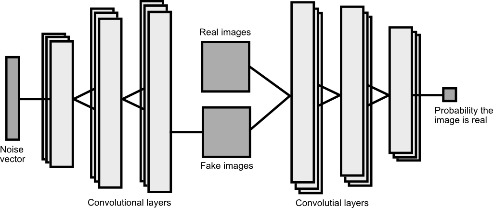
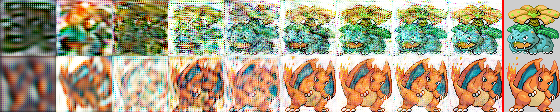
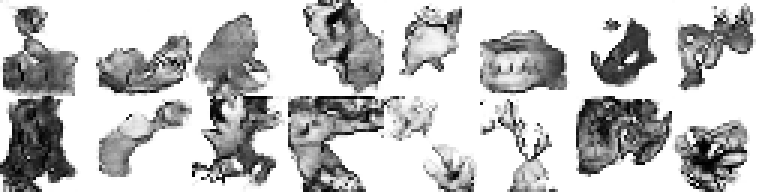
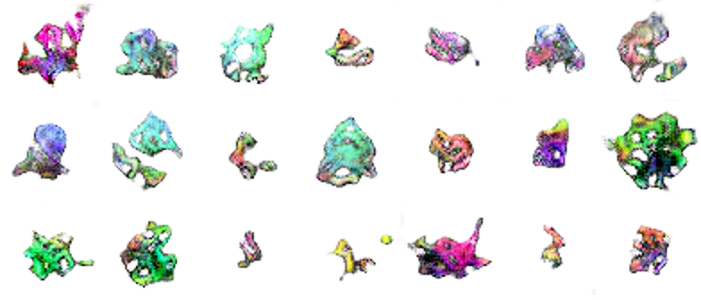

# Pokedex-Gen
## Creating new pokemon using a generative adversarial network
> By Sigve Røkenes

### About the project

The goal for this project was to train a generative adversarial network to create new pokemon sprites.
The task proved quite difficult, due to the large variance in the dataset.

Work in progress. Code coming later.

### Model

The generative adversarial network consists of two neural networks, the discriminator and generator.
The generator generates a new pokemon from a random noise vector. The fake image as well as real sprites are fed into the discriminator network, which attempts to determine which is real. The below figure illustrates the structure more clearly.

### Convergence

In order to prove that the GAN converged to generating data within the dataset distribution, I trained the network using batches of repeated images. After about 5 episodes the images are already quite recognisable as illustrated below.

Results after 9 epochs of training on a single image. (right side is ground truth)
**Row 1:** 16x16 convolutional layers
**Row 2:** 64x64 convolutional layers

#### Data augmentation

My dataset consisted of three spritesheets of pokemon, which had a total of about 1000 unique sprites. In order to increase the size of the dataset I have used simple augmentation such as flipping and hue shifting, increasing the dataset size 5 times.

### Initial results

The initial model was trained using single-channel downsampled 16x16 sprites. Below is a sample of results.

The model converged after approximately 1000 epochs, continuously yielding results as above.
The results show clear similarities to the dataset (structured elements, shadows, dark outlines) and are very good at separating sprites from backgrounds. They do however fall short in terms of overall high-level structure and anatomy.

### Colored results

> Work in progress
> Results with first model after ~200 epochs of training:
> 

