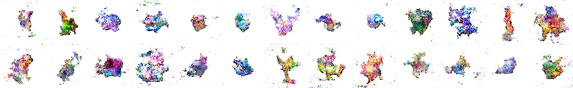

# Pokedex-Gen
## Creating new pokemon using a generative adversarial network

The goal for this project was to train a generative adversarial network to create new pokemon sprites.
The task proved quite difficult, due to the large variance in the dataset. Results are however insightful.

Read the writeup for this project on my website [here](http://evgiz.net/article/2019/02/01/).

### Model

The generative adversarial network consists of two neural networks, the discriminator and generator.
The generator uses multiple deconvolutional layers (convolutional transpose) to generate new pokemon from random noise vectors. The goal of the generator is to create images as convincing as possible. These images should therefore lie within the learnt distribution of the dataset.

The fake image as well as real sprites are fed into the discriminator network, which attempts to determine which is real. This process closely mirrors traditional supervised learning. The discriminator consists of multiple convolutional layers.

The below figure illustrates the complete model more clearly:

#### Convergence

In order to prove that the GAN converged to generating data within the dataset distribution, I trained the network using batches of repeated images. After about 5 episodes the images are already quite recognisable as illustrated below.

Results after 9 epochs of training on a single image. Right side is ground truth.

#### Data augmentation

My dataset consisted of three spritesheets of pokemon, which had a total of about 1000 unique sprites. In order to increase the size of the dataset I have used simple augmentation such as flipping, rotating, resizing and hue shifting, increasing the number of images by at least a factor of 5.

### Initial results

The initial model was trained using single-channel downsampled 16x16 sprites. Below is a sample of results.

The model converged after approximately 1000 epochs, continuously yielding results as above.
The results show clear features also present in the dataset (structured elements, shadows, outlines) and are very good at separating sprites from backgrounds. They do however fall short in terms of overall high-level structure and anatomy.

### Colored results

My second attempt used 3 channels and a slighly more complex network to generate colored images.
The following images are various examples of my results:

> 56x56 resolution results after ~200 epochs of training.
> Suffered mode collapse around this point (all generated outputs the same).

> 64x64 resolution results after ~500 epochs of training on a different model.
> Did not suffer mode collapse, and yielded varying generated results.
> Colors were however similar in most examples, and varied less than shape.

### Conclusion

The pokemon dataset has large variance, with many colors and patterns which are difficult to map in a continuous distribution. This makes it quite difficult to generate convincing new examples.

I have achieved a generative model which successfully maps some features of the dataset, and is able to generate various shapes with some shadows and outlines. The model falls short in terms of high level structure.

