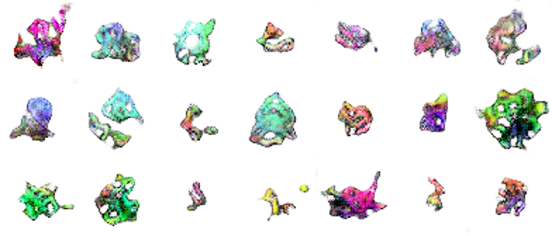

# Pokedex-Gen
## Creating new pokemon using a generative adversarial network

The goal for this project was to train a generative adversarial network to create new pokemon sprites.
The task proved quite difficult, due to the large variance in the dataset. Results are however insightful.

Read the writeup for this project on my website [here](http://evgiz.net/article/2019/02/01/).

